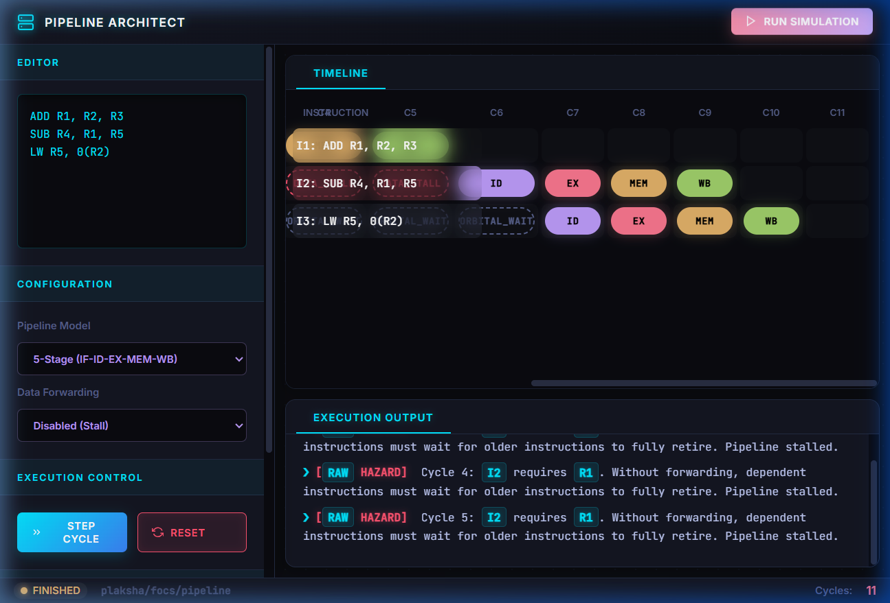

# Pipeline Architect 🚀

A highly-visual, mission-control themed interactive RISC Pipeline Hazard Simulator designed from first principles. Built entirely with vanilla web technologies, this simulator models true hardware behaviour down to the clock cycle.

## Overview

This tool visualizes the execution of a set of MIPS/RISC-like instructions in both 4-stage and 5-stage pipeline architectures. It accurately models:
- **Data Forwarding / Bypassing** enabled vs disabled logic.
- **RAW Hazards** and strict pipeline stall generation.
- **Load-Use penalties** resulting from memory access latencies.

## Conceptual Architecture

Instead of hardcoding the visualizations or guessing outputs, the engine treats instructions as individual entities progressing through a state machine representing physical hardware stages: `IF` (Fetch) → `ID` (Decode) → `EX` (Execute) → `MEM` (Memory) → `WB` (Writeback). 

During the **Decode (ID)** stage, the engine performs a "Backward Scan" through the pipeline to locate any older, unretired instructions writing to the current instruction's source registers. Based on the selected data forwarding rules and the specific active stages of those older instructions, the simulator determines whether to physically bypass the data or insert a stall bubble (`STALL`) until the dependency fully resolves.

## Features

- **Cyber-IDE Theme**: A highly vibrant, modern, IDE-style interface featuring custom neon highlights, glass-morphism panels, and dynamic responsive design.
- **Live Cycle Stepping**: Control the flow of time by stepping cycle-by-cycle or auto-running the entire sequence.
- **Auto-State Recognition**: The engine intelligently recognizes input changes and resets the hardware state instantly for frictionless experimentation without needing manual resets.
- **Intelligent Hazard Logging**: Get explicit, human-readable explanations of *why* the hardware stalled or forwarded data at any given cycle.

## Usage

Simply open `index.html` in any modern web browser to launch the application. Input your assembly instructions, configure your pipeline settings in the left pane, and click **Run Simulation**!
